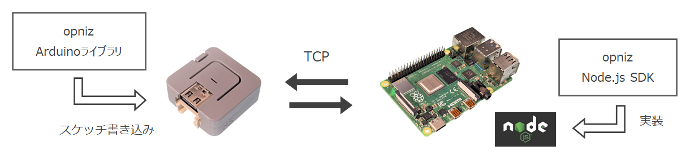

# opniz SDK for Node.js

`❗ このプロジェクトは現在アルファ版です。`

opnizとはM5StackといったESP32デバイスをNode.jsからobnizライクに制御するための、**Node.js SDK**および**Arduinoライブラリ**です。  
ざっくりいうとサーバーを介さない、オープンソースな、obnizっぽい実装ができるなにかです。  

しくみとしてはESP32デバイスおよびNode.js SDKにて**TCPサーバー/クライアントを実行**し、相互にTCP経由で**JSONメッセージ**をやりとりしています。  



現在Node.js SDK、Arduinoライブラリともに**ESP32**および**M5ATOM**クラスを実装しています。  
M5ATOMクラスで**M5Stack、M5StickC、M5ATOM Lite、M5ATOM Matrixでの動作を確認しています。**  

新たなデバイスクラスを簡単に拡張できる設計となっています。  
おってリファレンスも作成予定ですが、クラス拡張ハンズオンも作成予定です。  


## Node.js SDK

本リポジトリはNode.js SDKのリポジトリとなります。  
デバイスのRead/Writeを実行したり（Pinも動的に指定可能です）、デバイス側からのイベント（たとえばM5Stack系デバイスのボタン等）を受け取って非同期に処理を実行したりできます。  


## インストール方法

npmにはまだリリースしていないため、GitHubリポジトリをcloneのうえ`npm install`にてcloneディレクトリを指定しインストールします。  

```
mkdir opniz && cd opniz
git clone https://github.com/miso-develop/opniz-sdk-nodejs opniz
npm install ./opniz
```

別途デバイスへも[Arduinoライブラリ](https://github.com/miso-develop/opniz-device)を使用したスケッチの書き込みが必要です。  


## 使い方

❗ 事前にデバイスへ[opniz Arduinoライブラリ](https://github.com/miso-develop/opniz-device)を書き込んでください  

以下のコードは最小限のopnizのJavaScript実装コードです。  
opnizインスタンスの生成、opnizデバイスへの接続、デバイスへの操作の3ステップを実行しています。  
`address`、`port`をデバイスのIPアドレスと、任意のポート番号に書き換えて実行してみてください。  

```js
const { Opniz } = require("opniz")

const address = "192.168.0.1" // opnizデバイスのIPアドレスを指定
const port = 3000             // 任意のポートを指定（opnizデバイスでの指定と合わせる）

const main = async () => {
	const opniz = new Opniz.M5Atom({ address, port }) // opnizインスタンス生成
	await opniz.connect()                                 // opnizデバイスへ接続
	console.log(await opniz.getFreeHeap())                // opnizデバイスのヒープメモリーサイズを取得して表示
}
main()
```

実際にデバイスを24時間稼働で実装する場合は以下のようにループ実装します。  

```js
const { Opniz } = require("opniz")

const address = "192.168.0.1" // opnizデバイスのIPアドレスを指定
const port = 3000             // 任意のポートを指定（opnizデバイスでの指定と合わせる）

const main = async () => {
	// opnizインスタンス生成
	const opniz = new Opniz.M5Atom({ address, port })
	
	// opnizデバイスへ接続
	while (!(await opniz.connect())) {
		console.log("connect...")
		await opniz.sleep(1000)
	}
	console.log("[connected]")
	
	try {
		// 1秒おきにデバイスのヒープメモリーサイズを表示
		for (;;) {
			console.log(await opniz.getFreeHeap())
			await opniz.sleep(1000)
		}
		
	// エラー処理
	} catch(e) {
		console.log(`[error] ${e.message}`)
		await main()
	}
}
main()
```


## 実装例

❗ 事前にM5ATOMへ[opniz Arduinoライブラリ](https://github.com/miso-develop/opniz-device)を書き込んでください  

### M5ATOMでLチカ（内蔵LED）

M5ATOM（Lite、Matrixどちらでもかまいません）でLチカを行ってみます。  
まずはM5ATOMに内蔵されているLEDを制御します。  
※M5Stack、M5StickCは「M5ATOMでLチカ（ピンに挿したLED）」をお試しください  

以下のコードを実行すると1秒おきにLEDが青く点滅します。  
25行目の`await opniz.drawpix(0, color)`が内蔵LEDを制御するメソッドです。  
これはM5ATOMのArduinoライブラリで実装されている関数`M5.dis.drawpix`と名前、引数とも同じです。  
このようにデバイスをArduinoライブラリを用いて実装するのと同じ感覚でNode.jsにて実装できます。  

```js
const { Opniz } = require("opniz")

const address = "192.168.0.1" // opnizデバイスのIPアドレスを指定
const port = 3000             // 任意のポートを指定（opnizデバイスでの指定と合わせる）

const OFF = "#000000"
const BLUE = "#0000ff"
let color = OFF

const main = async () => {
	// opnizインスタンス生成
	const opniz = new Opniz.M5Atom({ address, port })
	
	// opnizデバイスへ接続
	while (!(await opniz.connect())) {
		console.log("connect...")
		await opniz.sleep(1000)
	}
	console.log("[connected]")
	
	try {
		// 1秒おきに内蔵LEDを青色で点滅
		for (;;) {
			color = color === OFF ? BLUE : OFF
			await opniz.drawpix(0, color)
			await opniz.sleep(1000)
		}
		
	// エラー処理
	} catch(e) {
		console.log(`[error] ${e.message}`)
		await main()
	}
}
main()
```

### M5ATOMでLチカ（ピンに挿したLED）

次に内蔵LEDではなく、ピンに挿したLEDを制御してみましょう。  
M5ATOM Lite、Matrixの場合、21番ピンとGNDにLEDを挿します（必要に応じて抵抗を添えてください）。  
※M5Stack、M5StickCはピン番号を任意に置き換えてお試しください  

以下のコードを実行すると1秒おきにLEDが点滅します。  
25行目の`await opniz.digitalWrite(21, value)`にて21番ピンをdigitalWriteで制御しています。  
このようにNode.js SDKより動的にピンをアサインして制御できます。  

```js
const { Opniz } = require("opniz")

const address = "192.168.0.1" // opnizデバイスのIPアドレスを指定
const port = 3000             // 任意のポートを指定（opnizデバイスでの指定と合わせる）

const HIGH = 1
const LOW = 0
let value = LOW

const main = async () => {
	// opnizインスタンス生成
	const opniz = new Opniz.M5Atom({ address, port })
	
	// opnizデバイスへ接続
	while (!(await opniz.connect())) {
		console.log("connect...")
		await opniz.sleep(1000)
	}
	console.log("[connected]")
	
	try {
		// 1秒おきに21番ピンとGNDに挿したLEDを点滅
		for (;;) {
			value = value === LOW ? HIGH: LOW
			await opniz.digitalWrite(21, value)
			await opniz.sleep(1000)
		}
		
	// エラー処理
	} catch(e) {
		console.log(`[error] ${e.message}`)
		await main()
	}
}
main()
```

### M5ATOMのボタンイベントを拾って処理する

次のコードを実行し、M5ATOMのボタンを押すとconsoleに`on button!`と表示されます。  
18行目の`opniz.onbutton = () => console.log("on button!")`のように`onbutton`メソッドを上書くことでボタンイベントを拾い、任意の処理を行います。  
このonメソッドはデバイスクラスにて任意に実装可能です。  

```js
const { Opniz } = require("opniz")

const address = "192.168.0.1" // opnizデバイスのIPアドレスを指定
const port = 3000             // 任意のポートを指定（opnizデバイスでの指定と合わせる）

const main = async () => {
	// opnizインスタンス生成
	const opniz = new Opniz.M5Atom({ address, port })
	
	// opnizデバイスへ接続
	while (!(await opniz.connect())) {
		console.log("connect...")
		await opniz.sleep(1000)
	}
	console.log("[connected]")
	
	// M5ATOMのボタンが押されたらconsole表示
	opniz.onbutton = () => console.log("on button!")
	
	try {
		// 無限ループ
		for (;;) {
			await opniz.sleep(1000)
		}
		
	// エラー処理
	} catch (e) {
		console.log(`[error] ${e.message}`)
		await main()
	}
}
main()
```


## ライセンス

[MIT](./LICENSE)
